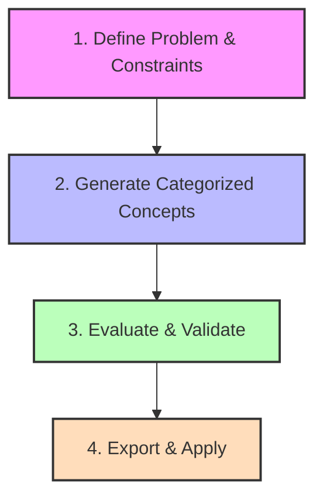

# User Story Map: Maritime AI R&D Assistant

This document outlines the product vision, user persona, high-level activities, and release stages for the **Maritime AI R&D Assistant**—a tool designed to help naval architects solve complex maritime contradictions and design challenges using constraint-aware concept generation.

---

## 👥 User Persona

```
┌────────────────────────────────────────────────────────────────────────┐
│  ELENA | Senior Naval Architect                                        │
├────────────────────────────────────────────────────────────────────────┤
│  "High-stakes maritime decisions require verifiable science, not       │
│   AI hallucinations."                                                  │
├────────────────────────────────────────────────────────────────────────┤
│  • Role: R&D lead for major shipyard / vessel design firm.            │
│  • Needs: Precise parameters, strict environmental & IMO compliance.    │
│  • Pain Points: Wasting time on physically impossible designs;        │
│    lack of traceability in typical generative AI outputs.              │
│  • Tolerance: Zero tolerance for unsourced or hallucinated answers.    │
└────────────────────────────────────────────────────────────────────────┘
```

---

## 🏃‍♂️ User Activities (High-Level Flow)

The typical workflow of a naval architect using the Maritime AI R&D Assistant follows a 4-step sequence:



---

## 🗺️ Miro-Style User Story Map

Below is the Miro-board style mapping of user tasks (columns) and stories grouped by release phases (rows).

| Release | Define Problem & Constraints | Generate Concepts | Evaluate & Validate | Export & Apply |
| :--- | :--- | :--- | :--- | :--- |
| **📦 Release 1 (Clean MVP)** | • Input maritime failure scenario<br>• Select basic constraint (e.g. *Zero Dry-Docking*) | • TRIZ Contradiction Solver<br>• Two-track Categorized Generation (Short-term/Easy vs. Long-term/High Impact) | • **Explainability Dashboard** (RAG scientific paper links + TRIZ principle matches)<br>• **Automated Constraint Warning / Reality Check** | • Save basic text concept |
| **🚀 Release 2 (Interactive R&D)** | • Turn constraints on/off on the fly (Dynamic Toggles) | • Select specific framework (TRIZ vs. Patent Search) | • Interactive concept feedback (Thumbs Up/Down/Unviable)<br>• Direct document Q&A chat | • Save concept summary to PDF |
| **🌐 Release 3 (Enterprise)** | • Auto-detect constraints from vessel specifications | • Real-time patent verification databases (EPO/USPTO) | • **Economic "Split-Incentive" Calculator** (Shipowner vs. Charterer) | • Export material specs directly to CAD/Naval architecture tools |

---

## 💡 Highlighted Core User Stories (Jury Focus)

These three capabilities address the core criteria evaluated by the hackathon jury:

### 1. 🔬 The "Explainability" Requirement (Primary Metric)
> **As a** Senior Naval Architect,
> **I want to** click on an AI-generated concept and immediately see the exact scientific papers and logical steps (Explainable AI) used to create it,
> **so that** I can confidently present this solution to the Board of Directors without fearing AI hallucinations.
*   **Key Feature**: Clickable cards mapping concepts to TRIZ principles and direct URLs/DOI citations of marine engineering papers.

### 2. ⚙️ The Contradiction Solver (Applying TRIZ)
> **As an** R&D Engineer,
> **I want to** input a technical contradiction (e.g., *We need to stop oil leaks, BUT we cannot increase the weight of the hull*)
> **so that** the AI can bypass traditional brute-force physics and suggest non-standard material innovations.
*   **Key Feature**: Automated translation of natural language descriptions into TRIZ parameters (e.g., Parameter 12: Shape vs. Parameter 2: Weight) using the MCP matrix lookup tools.

### 3. 🛑 The Automated Reality Check
> **As an** R&D Engineer,
> **I want the system to** automatically cross-reference generated ideas against operational constraints (e.g., weather, costs),
> **so that** I don't waste time exploring solutions that are physically impossible in real-world scenarios.
*   **Key Feature**: RAG-based warnings flagging issues such as polymer sealant failures in Arctic water or galvanic corrosion from smart metallic compounds.
